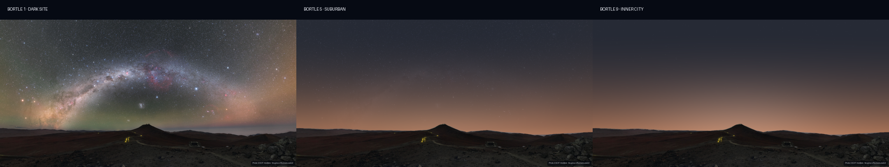

# SkyGlow

SkyGlow is an interactive light-pollution simulator built around a genuine high-resolution photograph of the Milky Way over ESO's Paranal Observatory.



## Why I built it

Light pollution is usually explained with maps, numbers, or photographs taken under completely different conditions. I wanted to make the loss more immediate: keep one real photograph fixed, then let someone watch its faint structure disappear.

I also wanted the project to be honest about what it is. SkyGlow is an educational simulation, not a planetarium or an observing forecast.

## What it does

- Moves through Bortle classes 1–9 with an interactive slider
- Includes presets for dark-sky, rural, suburban, and central-city conditions
- Compares a real dark-site photograph with the selected pollution level
- Fades compact stars and Milky Way contrast as skyglow increases
- Adds a warmer and brighter atmospheric glow near the horizon
- Shows an approximate limiting magnitude and naked-eye star estimate
- Switches between side-by-side and selected-sky views
- Downloads the selected scene as a PNG

The app uses one source photograph for all nine classes. It does not swap between unrelated locations.

## How the simulation works

SkyGlow begins with a real panoramic exposure from Cerro Paranal in Chile. Each Bortle class uses a deliberately chosen sky-contrast level. The program fades the whole celestial layer—including the broad Milky Way—then restores only compact stars bright enough for that class and adds a muted atmospheric-glow layer.

The boundary of the photographed mountain ridge is stored as a simple sky mask. The original foreground is composited back pixel-for-pixel, so rocks and terrain remain sharp at every level. The class-by-class values were visually calibrated together because one smooth formula did not give a believable progression. The result is a photographic visualization, although it is still not a calibrated prediction for a real address.

## What I learned

The first version generated every star and landscape layer in Python. It worked as a diagram, but it did not carry the emotional effect of an actual dark sky. My next attempt blurred the photograph to remove faint stars, which also blurred the ground and looked physically wrong. Replacing that shortcut with a sky mask and selective contrast reduction made the comparison much more convincing.

I also had to separate a clear visual explanation from a scientific prediction. The Bortle scale is useful, but visibility in real life also depends on weather, altitude, Moon phase, eyesight, and nearby lights. The app states that limitation instead of hiding it.

## Run it locally

```bash
git clone https://github.com/Hussain1802/skyglow.git
cd skyglow
python -m venv .venv
```

On Windows:

```powershell
.\.venv\Scripts\activate
pip install -r requirements.txt
streamlit run app.py
```

On macOS or Linux:

```bash
source .venv/bin/activate
pip install -r requirements.txt
streamlit run app.py
```

## Built with

- Python
- Streamlit
- NumPy
- Pillow

## Limitations

- The source image is a long-exposure photograph, not a literal naked-eye view
- Limiting magnitudes and Milky Way visibility are approximate
- The simulation does not model weather, Moon phase, altitude, or individual eyesight
- Star counts are broad naked-eye estimates, not counts measured from the photograph

## Photograph credit

The source photograph is **A Kaleidoscope of Colour** by **ESO/P. Horálek**, captured at Cerro Paranal, Chile.

- [Original ESO image](https://www.eso.org/public/images/potw2033a/)
- [Creative Commons Attribution 4.0 licence](https://creativecommons.org/licenses/by/4.0/)

SkyGlow uses a resized copy and applies simulated haze, contrast, and detail changes. The photograph remains under CC BY 4.0 and is not covered by the repository's MIT licence.
